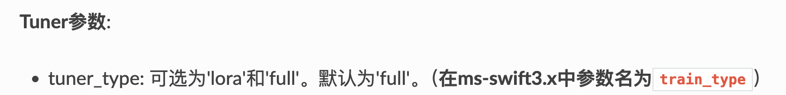

---

# ms-swift 3.x Megatron GRPO 官方示例参数修复指南

> **适用版本**: ms-swift 3.x 中使用 Megatron 启动训练，例如`megatron rlhf` 、`megatron sft`等
>
> **问题背景**: [ms-swift-megatron-grpo-dense-colocate](https://github.com/modelscope/ms-swift/blob/main/examples/megatron/grpo/dense_colocate.sh) 官方提供的 Megatron GRPO 训练示例脚本中，存在若干参数名称错误。直接使用会导致 `unrecognized arguments` 报错或参数被静默忽略。并且官方文档[ms-swift](https://swift.readthedocs.io/zh-cn/latest/Megatron-SWIFT/Command-line-parameters.html)仅指出了tuner_type的参数名更正情况，原文如下：
> tuner_type: 可选为'lora'和'full'。默认为'full'。（在ms-swift3.x中参数名为train_type）

> 本文档对照 `megatron rlhf --help` 的实际参数列表，逐一指出问题并给出修复方案。

---

## 问题复现
官方脚本如下所示：
```bash
# DP size = world_size // (context_parallel_size * tensor_model_parallel_size * pipeline_model_parallel_size)
#         = 8 // (1 * 1 * 1) = 8

# NOTE: global_batch_size and micro_batch_size are completion-level
# global_batch_size = micro_batch_size * DP size * gradient_accumulation_steps (128)
# generation_batch_size = global_batch_size * steps_per_generation (128 * 4 = 512)
# num_of_prompt_to_rollout = generation_batch_size / num_generations (512 / 8 = 64)
# num_of_prompt_to_train = generation_batch_size / num_generations (128 / 8 = 16)

CUDA_VISIBLE_DEVICES=0,1,2,3,4,5,6,7 \
NPROC_PER_NODE=8 \
MAX_PIXELS=602112 \
MASTER_PORT=29600 \
megatron rlhf \
    --rlhf_type grpo \
    --model Qwen/Qwen2.5-VL-3B-Instruct \
    --save_safetensors true \
    --context_parallel_size 1 \
    --tensor_model_parallel_size 1 \
    --pipeline_model_parallel_size 1 \
    --dataset AI-ModelScope/clevr_cogen_a_train#10000 \
    --num_train_epochs 1 \
    --global_batch_size 128 \
    --micro_batch_size 4 \
    --steps_per_generation 4 \
    --num_generations 8 \
    --external_plugins examples/train/grpo/plugin/plugin.py \
    --reward_funcs external_r1v_acc format \
    --use_vllm true \
    --vllm_mode colocate \
    --vllm_gpu_memory_utilization 0.7 \
    --vllm_max_model_len 10240 \
    --max_length 8192 \
    --max_completion_length 2048 \
    --tuner_type full \
    --lr 1e-6 \
    --bf16 true \
    --beta 0.001 \
    --importance_sampling_level token \
    --epsilon 0.2 \
    --epsilon_high 0.2 \
    --dynamic_sample false \
    --overlong_filter true \
    --loss_type grpo \
    --sleep_level 2 \
    --offload_model true \
    --offload_bridge false \
    --offload_optimizer true \
    --logging_steps 1 \
    --recompute_granularity selective \
    --finetune \
    --dataloader_num_workers 8 \
    --dataset_num_proc 8 \
    --no_save_optim \
    --no_save_rng \
    --attention_backend flash \
    --temperature 1.0 \
    --system examples/train/grpo/prompt.txt \
    --padding_free true \
    --log_completions true \
    --report_to wandb \
    --train_iters 100 \
    --eval_steps 1000 \
    --save_steps 1000

使用官方 Megatron GRPO 示例脚本直接运行时，如 bash dense_colocate.sh
```
会遇到以下典型报错：

```
ValueError: remaining_argv: ['--num_train_epochs', '1', '--logging_steps', '1', '--eval_steps', '200', '--save_steps', '10', '--dataloader_num_workers', '8', '--output_dir', '.....']
```

---

## 1. 确认性参数名错误（共 6 处，必须修复）

以下参数在 `megatron rlhf --help` 中**完全不存在**，直接使用会报错：

| # | 官方脚本错误写法 | 正确参数名 | 说明 |
|:---:|---|---|---|
| 1 | `--num_train_epochs 1` | `--max_epochs 1` | HuggingFace Trainer 风格参数名，Megatron 后端对应为 `--max_epochs` |
| 2 | `--tuner_type full` | `--train_type full` | 参数名拼写错误，正确为 `--train_type`，可选值: `{lora, full}` |
| 3 | `--logging_steps 1` | `--log_interval 1` | HuggingFace Trainer 风格参数名，Megatron 后端对应为 `--log_interval` |
| 4 | `--eval_steps 1000` | `--eval_interval 1000` | HuggingFace Trainer 风格参数名，Megatron 后端对应为 `--eval_interval` |
| 5 | `--save_steps 1000` | `--save_interval 1000` | HuggingFace Trainer 风格参数名，Megatron 后端对应为 `--save_interval` |
| 6 | `--dataloader_num_workers 8` | `--num_workers 8` | HuggingFace Trainer 风格参数名，Megatron 后端对应为 `--num_workers` |

### 错误根因

上述 6 个错误参数中，5 个（`num_train_epochs`、`logging_steps`、`eval_steps`、`save_steps`、`dataloader_num_workers`）均为 **HuggingFace Trainer** 的标准参数命名。推测官方示例在从 HuggingFace 训练脚本迁移至 Megatron 后端时，未完全将参数名适配到 Megatron 体系。`tuner_type` 则属于单纯的命名错误（正确为 `train_type`）。

---

## 2. 修复后的完整脚本

```bash
# DP size = world_size // (context_parallel_size * tensor_model_parallel_size * pipeline_model_parallel_size)
#         = 8 // (1 * 1 * 1) = 8

# NOTE: global_batch_size and micro_batch_size are completion-level
# global_batch_size = micro_batch_size * DP size * gradient_accumulation_steps (128)
# generation_batch_size = global_batch_size * steps_per_generation (128 * 4 = 512)
# num_of_prompt_to_rollout = generation_batch_size / num_generations (512 / 8 = 64)
# num_of_prompt_to_train = generation_batch_size / num_generations (128 / 8 = 16)

CUDA_VISIBLE_DEVICES=0,1,2,3,4,5,6,7 \
NPROC_PER_NODE=8 \
MAX_PIXELS=602112 \
MASTER_PORT=29600 \
megatron rlhf \
    --rlhf_type grpo \
    --model Qwen/Qwen2.5-VL-3B-Instruct \
    --save_safetensors true \
    --context_parallel_size 1 \
    --tensor_model_parallel_size 1 \
    --pipeline_model_parallel_size 1 \
    --dataset AI-ModelScope/clevr_cogen_a_train#10000 \
    --max_epochs 1 \
    --global_batch_size 128 \
    --micro_batch_size 4 \
    --steps_per_generation 4 \
    --num_generations 8 \
    --external_plugins examples/train/grpo/plugin/plugin.py \
    --reward_funcs external_r1v_acc format \
    --use_vllm true \
    --vllm_mode colocate \
    --vllm_gpu_memory_utilization 0.7 \
    --vllm_max_model_len 10240 \
    --max_length 8192 \
    --max_completion_length 2048 \
    --train_type full \
    --lr 1e-6 \
    --bf16 true \
    --beta 0.001 \
    --importance_sampling_level token \
    --epsilon 0.2 \
    --epsilon_high 0.2 \
    --dynamic_sample false \
    --overlong_filter true \
    --loss_type grpo \
    --sleep_level 2 \
    --offload_model true \
    --offload_bridge false \
    --offload_optimizer true \
    --log_interval 1 \
    --recompute_granularity selective \
    --finetune \
    --num_workers 8 \
    --dataset_num_proc 8 \
    --no_save_optim \
    --no_save_rng \
    --attention_backend flash \
    --temperature 1.0 \
    --system examples/train/grpo/prompt.txt \
    --padding_free true \
    --log_completions true \
    --report_to wandb \
    --train_iters 100 \
    --eval_interval 1000 \
    --save_interval 1000
```

---

## 3. 修复 Diff 对照

```diff
-    --num_train_epochs 1
+    --max_epochs 1

-    --tuner_type full
+    --train_type full

-    --logging_steps 1
+    --log_interval 1

-    --dataloader_num_workers 8
+    --num_workers 8

-    --eval_steps 1000
+    --eval_interval 1000

-    --save_steps 1000
+    --save_interval 1000
```

---

## 4. 快速验证方法

修复后可通过以下方式检查脚本中的参数是否均被 CLI 识别：

```bash
# 提取 --help 中所有合法参数名
megatron rlhf --help 2>&1 | grep -oP '(?<=--)\w+' | sort -u > valid_args.txt

# 提取你的脚本中所有参数名
grep -oP '(?<=--)\w+' your_script.sh | sort -u > script_args.txt

# 对比找出不合法的参数
comm -23 script_args.txt valid_args.txt
```

如果输出为空，说明所有参数均已合法。

---

**贡献**: 如果你发现其他参数问题，欢迎提交 Issue 或 PR。